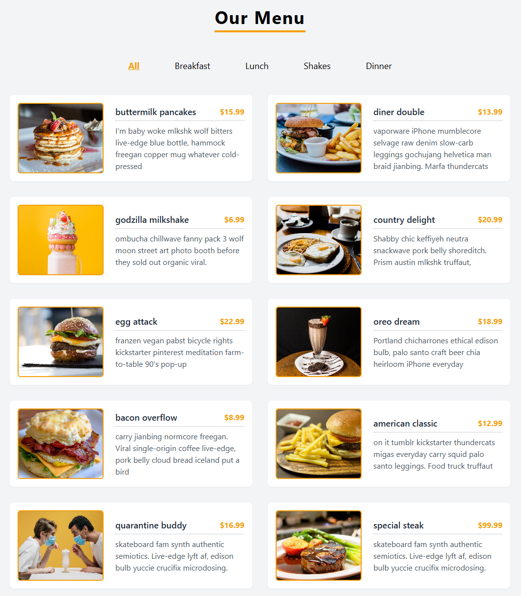

## 🍽️ Food Menu App



A responsive React.js [FoodMenuApp](https://foodmenuappreact.netlify.app) to display food items by category, like Breakfast, Lunch, Shakes, etc. Built with Tailwind CSS and deployed on Netlify.

---

## 🚀 Features

- Filter menu by category
- Responsive layout (mobile, tablet, desktop)
- Tailwind CSS styling
- Component-based architecture
- Deployed with Netlify

---

## 🖥️ Live Demo

🔗 [View Live on Netlify](https://foodmenuappreact.netlify.app)

---

## 📂 Folder Structure

FoodMenuApp/

├── public/

├── src/

│ ├── components/

│ │ ├── Header.jsx

│ │ ├── CategoryList.jsx

│ │ ├── MenuList.jsx

│ │ └── SingleMenu.jsx

│ ├── data.js

│ └── App.jsx

├── package.json

├── tailwind.config.js

└── README.md

---

## 🛠️ Tech Stack

- **React.js**
- **Tailwind CSS**
- **JavaScript (ES6+)**
- **Netlify (for deployment)**

---

## 🧑‍💻 Installation

1. **Clone the repo**

```bash
git clone https://github.com/Minoar98/FoodMenuApp.git
cd FoodMenuApp
Install dependencies

bash
npm install
Run locally

bash
npm run dev   # or: npm start
```
